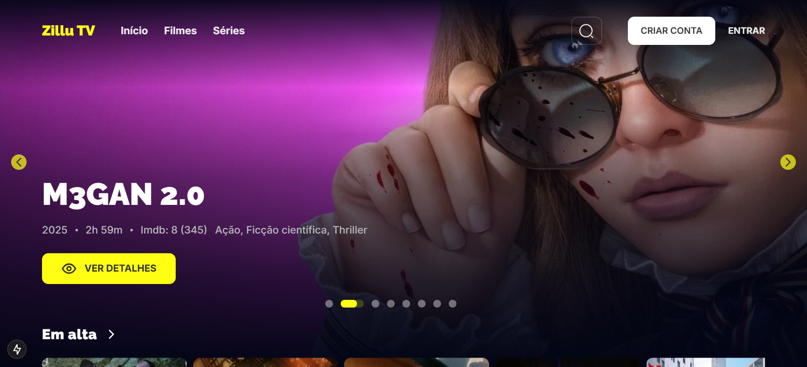

<a id="readme-top"></a>

# **🍿 ZilluTV - Filmes, séries e animes**



<br/>
<br/>


# **📖 Sobre o Projeto**

Uma plataforma web moderna e responsiva desenvolvida para oferecer aos usuários uma experiência fluida na descoberta e visualização de informações sobre filmes e séries.

O projeto foi pensado com foco na organização do código, reutilização de componentes e melhoria contínua da interface, resultando em uma navegação agradável e intuitiva.

Conta com modais personalizados para login e registro, páginas otimizadas para diferentes tamanhos de tela e um design refinado que valoriza a experiência do usuário.

<br/>

<p align="right">(<a href="#readme-top">Voltar ao topo</a>)</p>


# **🛠️ Tecnologias utilizadas**

- 
- 
- 
- 
- 
- 
- 

<br/>

<p align="right">(<a href="#readme-top">Voltar ao topo</a>)</p>


# **🎯 Funcionalidades**

- Exibição de filmes, séries e animes com informações detalhadas.
- Sistema de busca e filtros por categorias.
- Player de trailer responsivo.
- Login e registro utilizando:
  - E-mail e senha.
  - Google.
  - GitHub.
- Gerenciamento de conta:
  - Alteração de nome e e-mail.
  - Alteração de foto de perfil
  - Confirmação via e-mail
- Design responsivo e esteticamente agradável.

<br/>

<p align="right">(<a href="#readme-top">Voltar ao topo</a>)</p>


# **📦 Instalação**

1. Obtenha uma chave de API gratuita em [https://www.themoviedb.org](https://www.themoviedb.org)  

2. Clone o repositório  
   ```sh
   git clone https://github.com/888888b/zillutv.git
   ```
3. Instale os pacotes NPM  
   ```sh
   npm install
   ```
4. Insira sua chave de API em `.env`  
   ```ts
   NEXT_PUBLIC_TMDB_API_KEY='INSIRA SUA API'
   ```
5. Altere a URL remota do Git para evitar pushes acidentais no projeto base  
   ```sh
   git remote set-url origin github_username/repo_name
   git remote -v # confirme as alterações
   ```

<br/>

<p align="right">(<a href="#readme-top">voltar ao topo</a>)</p>


## **🙌 Créditos**

Desenvolvido por **Vitor Hugo** - (vitorhugo621contato@gmail.com).<br/>
Link do projeto - (https://plataforma-filmes-three.vercel.app/)<br/>
Inspiração e aprendizado: Youtube, IAs e documentações oficiais.

<br/>

<p align="right">(<a href="#readme-top">Voltar ao topo</a>)</p>

Sinta-se à vontade para explorar!<br/>
Este projeto está licenciado sob a licença MIT. Consulte o arquivo [LICENSE](LICENSE) para mais informações.